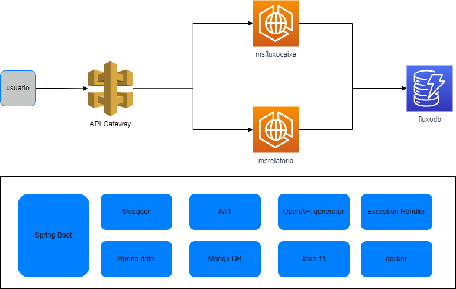

# Relatorio Fluxo Caixa

Aplicação de relatorio do fluxo de caixa construída na arquitetura de microserviço em conjunto com as boas praticas de desenvolvimento, código limpo, os principios do SOLID e a arquitetura hexagonal(ports and adapters) 

# Desenho da arquitetura

 
# Tecnologias e bibliotecas utilizados

* Swagger
* Spring boot
* Spring Data
* Spring Security
* Mongo DB
* JWT
* Prometheus
* Docker

#Execução do projeto
Obg: É necessario ter o docker e java 11 instalados
* Caso não esses passos foram feitos no microserviço de fluxo de caixa não sera mais necessário faze-los novamente
* Navegar até o diretorio \docker e executar o comando docker-compose up
###Execução da aplicação
* Navegar até o diretorio raiz e executar a aplicação pelo terminal mvn spring-boot:run

## Testes
•	Foram utilizados testes unitarios e de integração. A imagem abaixo mostra a cobertura de codigo dos serviços

## Observalidade
* Foi adicionado a opção de observalidade, health check e metricas com o prometheus.
* Para visualizar acesse http://localhost:8001/actuator/prometheus
* Cada serviço possui um endpoint para health check, ex: http://localhost:8001/actuator/health